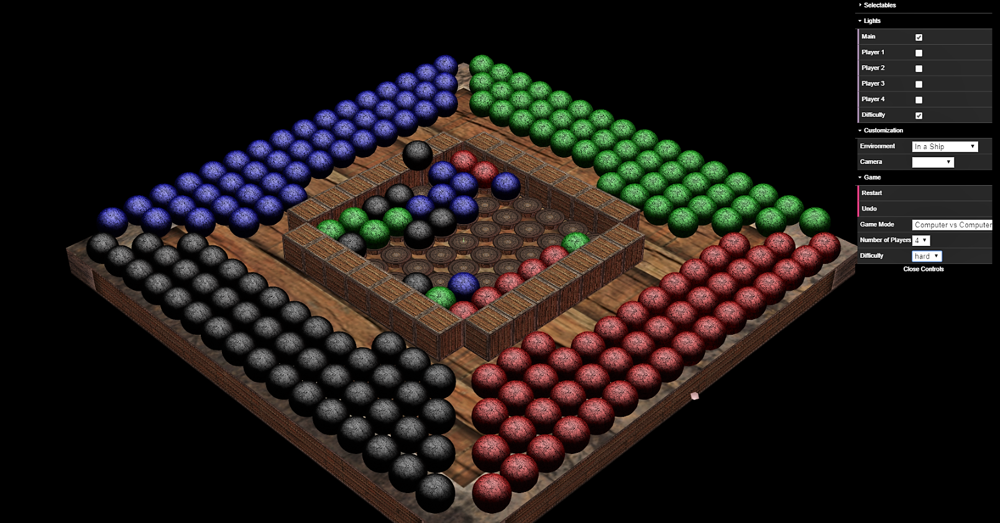

# Shiftago in WebGL
__Shiftago__ is a game in which the goal is to make a _horizontal_, _vertical_, or _diagonal_ line along the board. 

It is only possible to _add pieces_ to the board by its _edges_, and it is not possible to add pieces to already full lines.

This is an implementation of the board game __Shiftago__ using the _WebGL_ library [WebCGF](https://paginas.fe.up.pt/~ruirodrig/pub/sw/webcgf/docs/).

For more information about the Prolog component visit: [Shiftago-Prolog repo](https://github.com/BlueDi/Shiftago-Prolog).

## Instructions
Use [_Mongoose web server_](https://cesanta.com/) and set its `document_root` to the repository folder.
